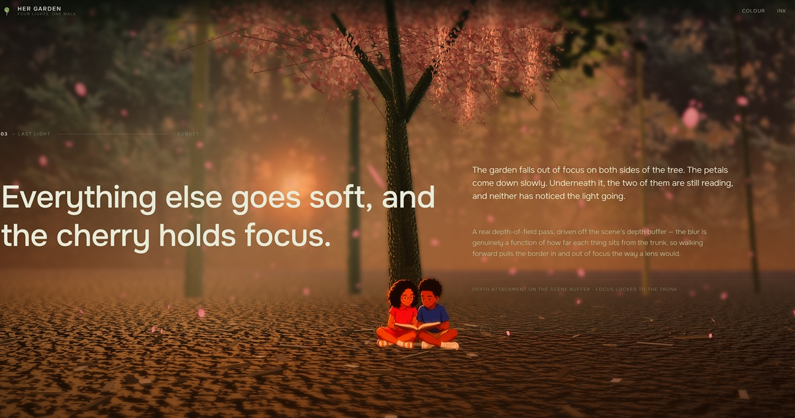

# Her Garden

An interactive four-chapter walk through my auntie's garden, rebuilt live in
Three.js and lit four different ways. Move the cursor to walk; scroll to go
deeper.

[View the live project](https://nocodekage.github.io/aunties-garden/) ·
[View the source](https://github.com/nocodekage/aunties-garden/blob/main/index.html) ·
[Read the build prompt](https://github.com/nocodekage/aunties-garden/blob/main/PROMPT.md)



> **The entry point is `index.html` at the repo root.** That is the master, and
> it is what GitHub Pages serves. It needs `garden-assets/` and `vendor/` sitting
> beside it.
>
> **It must be served over http, not opened off the disk.** Double-clicking it
> gives every file its own opaque origin, so the browser refuses to read the
> project's own images into WebGL textures — the two children under the cherry
> tree and the far tree line go missing, and nothing else looks wrong. The page
> detects this and says so on screen. Any static server will do:
>
> ```bash
> python3 -m http.server 4173
> ```
>
> `standalone/index.html` is the same scene folded into a single 2.8 MB file with
> every asset inlined. It has no dependencies, so it *does* work from the disk —
> useful for sending to someone, not what Pages serves.

## What it does

- Walks a live WebGL camera from the lawn, through the border, into the wood and
  out to a cherry tree in a glade. The cursor steers — it slides you across the
  path, tilts the view, and puts a footstep bob underneath you while you move.
- Renders the same garden under four treatments that crossfade into one another
  as you scroll, over one unbroken camera move:
  1. **Colour** — the garden as it stands, full afternoon.
  2. **Ink** — pen and a four-band grey wash on paper, edges found with a Sobel
     pass over a blurred copy so it draws masses rather than every leaf.
  3. **Moonlight** — a Fresnel rim gated on the moon vector, so every trunk,
     needle and leaf picks up a silver edge on the side turned to the moon.
  4. **Blossom** — sunset, falling petals, a real depth-of-field pass driven off
     the scene's depth buffer, focus locked to the cherry trunk. Two children
     sit underneath it reading.

## Where it comes from

Twenty-seven photographs of the garden, taken in about eleven seconds.

Every colour in the scene was sampled out of those frames rather than picked by
eye — the lawn's yellow-green (`#97bd5f`), the blue spruce silver (`#c4dacd`),
the gold wedding-cake dogwood (`#dad486`), the near-black conifers (`#111518`),
the dusk sky (`#f2edf0`). They are collected in the `P` table near the top of
the script.

The photographs make a poor *cutout* source — one fixed viewpoint of a garden
where everything overlaps, so there is no clean boundary to key against except
where foliage meets sky. So they are used for what they are actually good for:
the palette, and the far backdrop, where real tree-line silhouettes are keyed
against real sky. Everything nearer than the backdrop is built procedurally, and
that is also what makes the four treatments possible — rim lighting and
depth-of-field both need real geometry and real depth.

## How it is made

`index.html` holds the document, the CSS, the scene construction, the scroll and
cursor choreography, and the post-processing chain. A vendored Three.js r149
build supplies WebGL. No build step, no framework, no package manager.

Textures are painted at runtime onto 2D canvases and handed to Three as
`CanvasTexture` — bark, mown lawn, shredded mulch, leaf-mass sprites, hosta
clumps, blossom, petals. Geometry is generated: the woodland trunk field with a
glade carved around the cherry, the whorled blue spruce, the tiered dogwood, the
border, the fence, the statue.

The repo root *is* the site — there is no build step and no `dist/`, so what
you see here is what gets served.

```text
aunties-garden/
├── index.html            ← THE MASTER. Pages serves this. Needs the two
│                           folders below sitting beside it.
├── garden-assets/          the six keyed plates
│   ├── treeline-*.webp     backdrop silhouettes, keyed against real sky
│   ├── maple-left.webp     the lower-corner branches
│   ├── maple-right.webp
│   └── kids-reading.webp   the two of them, under the cherry
├── vendor/
│   ├── three.min.js        r149, MIT
│   └── fonts.css
├── .nojekyll               stops Pages running the folder through Jekyll
│
├── standalone/index.html   the same scene as one self-contained file
└── archive/                the Kyoto temple this began as
```

## Run locally

```bash
python3 -m http.server 4173 --bind 127.0.0.1
```

Then visit [http://127.0.0.1:4173/](http://127.0.0.1:4173/). Any static server
works; there is no runtime network dependency.

## Debug switches

Appended to the URL:

| Param | Effect |
| --- | --- |
| `?shot=N` | jump straight to chapter N in a deterministic state |
| `?driver=timer` | drive the loop from `setTimeout` instead of `requestAnimationFrame` (a hidden tab never fires rAF) |
| `?grab=1` | keep the drawing buffer so a frame can be read back |
| `?q=low` | force the low-quality path |
| `?post=0` | bypass the whole post chain |
| `?dpr=N` | pixel-ratio cap |
| `?adapt=0` | freeze the resolution governor |
| `?nogl=1` | force the no-WebGL fallback |

## Credits

The garden is my auntie's. The two children come from character sheets of my own
and were re-rendered into summer clothes for the last chapter. The Three.js r149
runtime keeps its MIT licence notice.

Built on top of [Kage](https://github.com/MengTo/kage) by Meng To, which supplied
the single-file architecture — the fixed canvas under scrolling content, the
waypoint camera spline, the loading-job list, and the bloom pipeline.

## How it was built

Written with [Claude Code](https://claude.com/claude-code), directed by me.

I set the brief and made the calls — which four lights, where the camera walks,
that the ground needed real bark chips, that "wood" beats "forest". Claude wrote
the shaders, the geometry and the post chain, and did the part I could not have
done by eye: measuring its own output. The ink chapter's body copy was failing
at 1.76:1 contrast against the paper and 1.01:1 against the mid wash, which is
not low contrast, it is invisible. That got caught by measurement, not opinion.

The build prompt in [`PROMPT.md`](PROMPT.md) is the honest version — written
after the fact, describing what the thing actually turned out to need rather
than what I thought it would need when I started.
